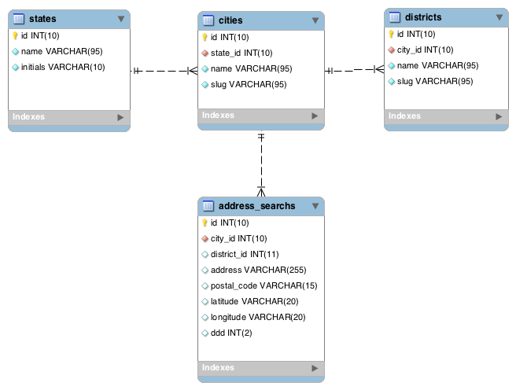

# Cep Brasil

Projeto que tem o intuito de disseminar e tornar público todos os CEPS brasileiros nos sistemas de gerenciamento de banco de dados mais usados do mercado :)

  - Estados
  - Cidades
  - Bairros
  - Logradouros

## Atualização JUNHO 2019

  - Atualizado em 6 a 6 meses.
  - Completamente gratis.


## Schema
 <br>

### SGBD

Os sistemas de gerenciamento de banco de dados utilizados nesse projeto foram:

* [sqlLite] - SQLite é uma biblioteca em linguagem C que implementa um banco de dados SQL embutido. Programas que usam a biblioteca SQLite podem ter acesso a banco de dados SQL sem executar um processo SGBD separado.

* [mongoDb] - MongoDB é um software de banco de dados orientado a documentos livre, de código aberto e multiplataforma, escrito na linguagem C++.

* [sqlServer] - O Microsoft SQL Server é um sistema gerenciador de Banco de dados relacional desenvolvido pela Microsoft.

* [mysql] - O MySQL é um sistema de gerenciamento de banco de dados, que utiliza a linguagem SQL como interface. É atualmente um dos sistemas de gerenciamento de bancos de dados mais populares da Oracle Corporation, com mais de 10 milhões de instalações pelo mundo.

* [postGree] - PostgreSQL é um sistema gerenciador de banco de dados objeto relacional, desenvolvido como projeto de código aberto.


### Iniciando

Para iniciar a utilizacão da nossa base de dados de cep, se você ainda nao tiver um banco de dados deve-se criar o mesmos para que as tabelas possam ser inseridas dentro dele.

Mysql:
```sql
 CREATE DATABASE cep-brasil; 
```

PostGree:
```sql
 CREATE DATABASE cep-brasil; 
```

sqlLite:
```sql
 CREATE DATABASE cep-brasil; 
```
Mongo Db:
```sql
 CREATE DATABASE cep-brasil; 
```
SqlServer:
```sql
 CREATE DATABASE cep-brasil; 
```

### Todos

 - Migrar para [postGree]
 - Migrar para [sqlLite]
 - Migrar para [mongoDb]
 - Migrar para [sqlServer]

Licenças
----


**Banco de Dados Gratuito :)**

[//]: # (These are reference links used in the body of this note and get stripped out when the markdown processor does its job. There is no need to format nicely because it shouldn't be seen. Thanks SO - http://stackoverflow.com/questions/4823468/store-comments-in-markdown-syntax)


   [sqlLite]: <https://www.sqlite.org/index.html>
   [mongoDb]: <https://www.mongodb.com>
   [sqlServer]: <https://www.microsoft.com/pt-br/sql-server/sql-server-downloads>
   [mysql]: <https://www.mysql.com/>
   [postGree]: <https://www.postgresql.org/>
